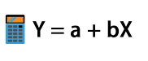

# Presentación
Hola, mi nombre es Christian Chiroque y bienvenidos a Data Política. Aquí podrás encontrar información que te ayudará en el aprendizaje de estadística aplicada al análisis político y social. También puedes chequear directamente mi canal de Youtube [Data Política](https://www.youtube.com/channel/UCjsP5ejsSyUchRl2oA96J3A), espacio en el cual vengo compartiendo tutoriales sobre los principales temas en estadística aplicada usando el software R Studio y SPSS. 

Esta es una iniciativa personal desarrollada desde el 16 de mayo del 2019, en el marco de mi labor docente en la Facultad de Ciencias Sociales de la Pontificia Universidad Católica del Perú - PUCP.

# Contenido

# Primera Parte

_______________________________________________________________________________________________________________________________________

## Introducción al R Studio

- ¿Qué es el R Studio y cómo se instala?
- ¿Cómo se programa en R?
- Fuentes de información

_______________________________________________________________________________________________________________________________________

## Estadística Descriptiva

- Estadísticos de tendencia central
- Tablas de contingencia
- Gráficos

_______________________________________________________________________________________________________________________________________

## Estadística Inferencial

- Intervalos de confianza 
- Pruebas de normalidad
- Prueba T de Student
- ANOVA de un factor
- Chi cuadrado
- Medidas de asociación (categóricas)
- Correlación

_______________________________________________________________________________________________________________________________________

## Modelamiento

- [Verificación de Supuestos](https://datapolitica.github.io/Prueba1)
- [Regresión Lineal Simple](https://datapolitica.github.io/salidas/regresion_lineal_simple.html)
- [Regresión Lineal Múltiple](https://datapolitica.github.io/salidas/regresion_lineal_multiple.html)
- [Inclusión de categóricas en modelos de regresión](https://datapolitica.github.io/salidas/regresion_categoricas.html)

_______________________________________________________________________________________________________________________________________

# Segunda Parte
_______________________________________________________________________________________________________________________________________

- Análisis factorial
- Análisis de conglomerados
  - Análisis por 

_______________________________________________________________________________________________________________________________________
# Sobre el autor

[Christian Chiroque Ruiz](https://www.linkedin.com/in/christianchr/). Politólogo y candidato a Maestro en Gerencia Social, con mención en Gerencia de Programas y Proyectos de Desarrollo, por la Pontificia Universidad Católica del Perú. Especialista en Estadística Aplicada por la Escuela Nacional de Estadística e Informática. Docente - Youtuber PUCP.

